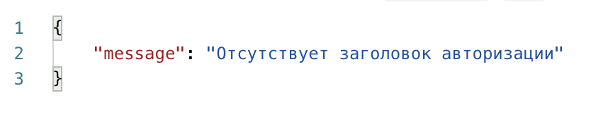
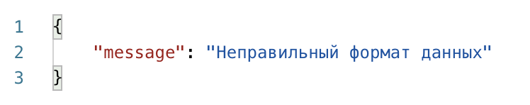

# Тренажер POST / GET запросов

Приветствую! Сегодня тебе предстоит потренироваться отправлять запросы, но перед тем как мы приступим к делу, нужно настроить пару вещей 🧐

Для выполнения задания клонировать себе репозиторий НЕ нужно.

## Авторизация
Чтобы сервер понял, кто ты, укажи в заголовке авторизации свой nickname с GitHub. 

Например, так может выглядеть отправка POST-запроса с помощью fetch с заполненным заголовком. Только вместо `PolinaShneider` укажи свой. Строку "Bearer:" **не трогай**

```js
fetch(`<адрес>`, {
    method: 'POST',
    headers: {
      'Accept': 'application/json',
      'Content-Type': 'application/json',
      'Authorization': 'Bearer: PolinaShneider'
    },
    body: JSON.stringify({text: "Hello"}),
})
```

Если ты не укажешь заголовок авторизации или удалишь слово Bearer, сервер тебе вернет следующий ответ:



## API запросов

Ну что, с заголовком разобрались. Теперь сервер знает, что ты — это ты, и можно отправлять данные.

### Отправка данных
Для отправки данных используй адрес `http://46.21.248.81:3001/user`, запрос `POST`, в теле должна находиться информация о пользователе в следующем формате:

```JSON
{
    "name": "Полина",
    "secondName": "Shneider",
    "phone": 89990000000,
    "email": "polina@gmail.com",
    "agree": true
}
```

Если какого-то из полей не окажется, сервер вернет тебе ответ:



### Получение данных

Для самопроверки ты можешь использовать следующие адреса:

* `http://46.21.248.81:3001/my-users` — получить всех своих пользователей
* `http://46.21.248.81:3001/last-user` — получить последнего добавленного пользователя

Оба запроса — `GET`. Также не забывай передавать заголовок авторизации. Без него сервер не поймет, чьих пользователей нужно вернуть.

На этом все. Удачи в выполнении тренажера!
